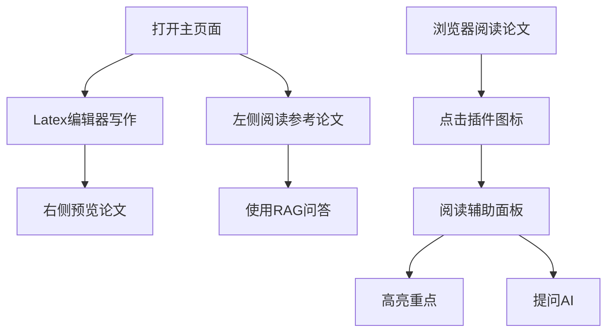

## 1. Product Overview
PaperMind是一个基于Chrome插件的自动化AI科研辅助系统，为科研工作者提供论文搜索、阅读辅助、智能问答和论文写作的一站式解决方案。

## 2. Core Features

### 2.1 User Roles
| Role | Registration Method | Core Permissions |
|------|---------------------|------------------|
| Researcher | Browser extension install | Full access to all features |

### 2.2 Feature Module
1. **Main Workspace**: Latex编辑器(中间)、论文预览(右侧)、阅读辅助(左侧)
2. **Paper Search**: 论文搜索与引用管理
3. **RAG Q&A**: 基于知识库的智能问答
4. **Knowledge Graph**: 论文知识图谱可视化
5. **Browser Extension**: 阅读文献时的沉浸式互动辅助

### 2.3 Page Details
| Page Name | Module Name | Feature description |
|-----------|-------------|---------------------|
| Main Workspace | Latex Editor | 支持Latex语法的论文编辑器，实时预览 |
| Main Workspace | Paper Preview | 展示Latex编译后的论文内容 |
| Main Workspace | Reading Assistant | 论文阅读界面，支持高亮、笔记、AI问答 |
| Paper Search | Search Panel | 搜索论文，查看摘要、引用信息 |
| RAG Q&A | Chat Interface | 与知识库对话，获取论文相关知识 |
| Knowledge Graph | Graph Visualization | 展示论文之间的引用关系和知识关联 |
| Browser Extension | Sidebar | 在任意网页上提供阅读辅助功能 |

## 3. Core Process
1. 打开主页面 → 使用Latex编辑器写作 → 右侧预览论文 → 左侧阅读参考论文
2. 在浏览器中阅读论文 → 点击插件图标 → 打开阅读辅助面板 → 高亮重点、提问AI
3. 搜索论文 → 添加到阅读列表 → 在阅读辅助中打开 → 使用RAG问答

## 4. User Interface Design

### 4.1 Design Style
- **Primary Color**: #3B82F6 (科研蓝)
- **Secondary Color**: #8B5CF6 (知识紫)
- **Accent Color**: #10B981 (成功绿)
- **Background**: #0F172A (深色主题)
- **Text**: #F8FAFC (浅色文本)
- **Button Style**: 圆角、渐变、hover动画
- **Font**: JetBrains Mono (代码), Inter (正文)
- **Layout**: 三栏布局，左侧阅读、中间编辑、右侧预览
- **Icon Style**: Lucide图标，简约现代

### 4.2 Page Design Overview
| Page Name | Module Name | UI Elements |
|-----------|-------------|-------------|
| Main Workspace | Layout | 三栏自适应布局，拖拽调整宽度 |
| Main Workspace | Latex Editor | 代码高亮、行号、语法提示、工具栏 |
| Main Workspace | Preview | PDF风格预览、目录导航、缩放 |
| Main Workspace | Reading Assistant | 论文内容、高亮标记、笔记、问答面板 |
| Paper Search | Search | 搜索框、筛选器、结果卡片列表 |
| RAG Q&A | Chat | 对话气泡、输入框、发送按钮 |
| Knowledge Graph | Graph | 力导向图、节点拖拽、信息面板 |

### 4.3 Responsiveness
- Desktop-first设计
- 支持响应式布局，移动端自动调整为单栏堆叠
- 触控优化的按钮和交互元素

### 4.4 Special Effects
- Latex编辑器实时编译动画
- 知识图谱节点连接动画
- 阅读辅助高亮动画
- 平滑的页面切换和过渡效果