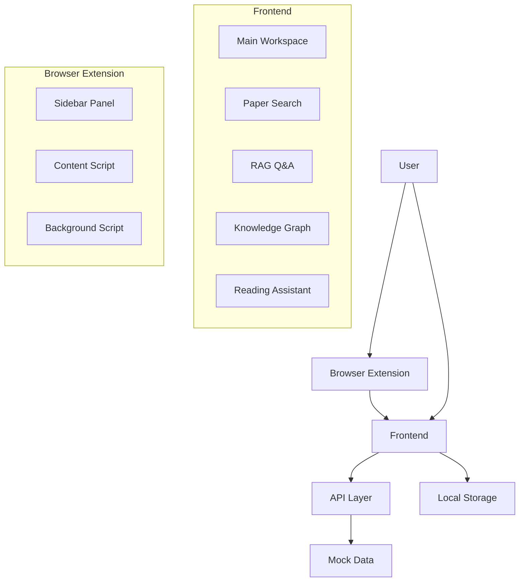
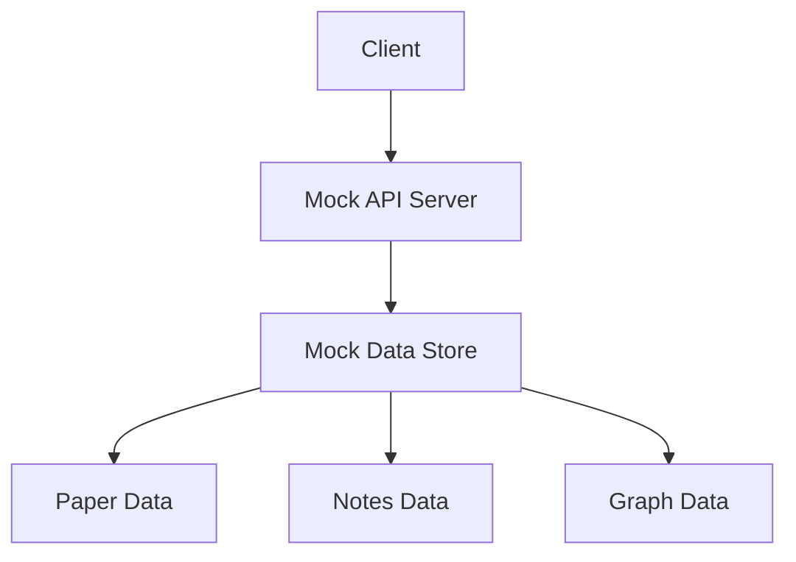
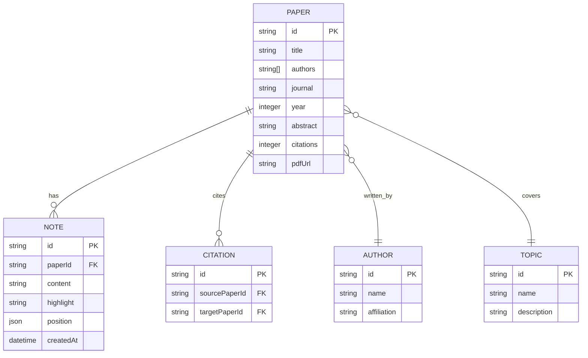

## 1. Architecture Design


## 2. Technology Description
- **Frontend**: React@18 + TypeScript + TailwindCSS@3 + Vite
- **State Management**: Zustand
- **Routing**: React Router DOM
- **Icons**: Lucide React
- **Graph Visualization**: D3.js / Force Graph
- **Latex Rendering**: KaTeX
- **Code Editor**: CodeMirror / Monaco Editor
- **Backend**: Mock API (Demo版)
- **Browser Extension**: Manifest V3

## 3. Route Definitions
| Route | Purpose |
|-------|---------|
| / | Main workspace page |
| /search | Paper search page |
| /rag | RAG Q&A page |
| /graph | Knowledge graph page |

## 4. API Definitions (Mock)

### 4.1 Paper Search API
**GET /api/papers?q={query}&page={page}&limit={limit}**
```typescript
interface Paper {
  id: string;
  title: string;
  authors: string[];
  journal: string;
  year: number;
  abstract: string;
  citations: number;
  pdfUrl: string;
}

interface SearchResponse {
  papers: Paper[];
  total: number;
  page: number;
  limit: number;
}
```

### 4.2 RAG Q&A API
**POST /api/rag/query**
```typescript
interface RagQueryRequest {
  query: string;
  context?: string[];
}

interface RagQueryResponse {
  answer: string;
  sources: string[];
  confidence: number;
}
```

### 4.3 Knowledge Graph API
**GET /api/graph/nodes**
```typescript
interface GraphNode {
  id: string;
  label: string;
  type: 'paper' | 'author' | 'topic';
  x: number;
  y: number;
}

interface GraphEdge {
  source: string;
  target: string;
  type: 'cites' | 'author' | 'related';
}

interface GraphResponse {
  nodes: GraphNode[];
  edges: GraphEdge[];
}
```

### 4.4 Reading Notes API
**GET /api/notes?paperId={paperId}**
**POST /api/notes**
**PUT /api/notes/{id}**
**DELETE /api/notes/{id}**
```typescript
interface Note {
  id: string;
  paperId: string;
  content: string;
  highlight: string;
  position: { start: number; end: number };
  createdAt: string;
}
```

## 5. Server Architecture Diagram (Mock)


## 6. Data Model

### 6.1 Data Model Definition


### 6.2 Data Definition Language (Mock)
```typescript
// Mock Paper Data
const mockPapers = [
  {
    id: '1',
    title: 'Attention Is All You Need',
    authors: ['Vaswani, A.', 'Shazeer, N.', 'Parmar, N.', 'Uszkoreit, J.'],
    journal: 'NeurIPS',
    year: 2017,
    abstract: 'The dominant sequence transduction models are based on complex recurrent or convolutional neural networks...',
    citations: 100000,
    pdfUrl: '#'
  }
];

// Mock Graph Data
const mockGraph = {
  nodes: [
    { id: 'p1', label: 'Attention Is All You Need', type: 'paper' },
    { id: 'a1', label: 'Vaswani', type: 'author' },
    { id: 't1', label: 'Transformer', type: 'topic' }
  ],
  edges: [
    { source: 'p1', target: 'a1', type: 'author' },
    { source: 'p1', target: 't1', type: 'related' }
  ]
};

// Mock Notes Data
const mockNotes = [
  {
    id: 'n1',
    paperId: '1',
    content: 'This is a groundbreaking paper introducing the Transformer architecture.',
    highlight: 'Attention mechanism',
    position: { start: 0, end: 20 },
    createdAt: '2024-01-01T00:00:00Z'
  }
];
```